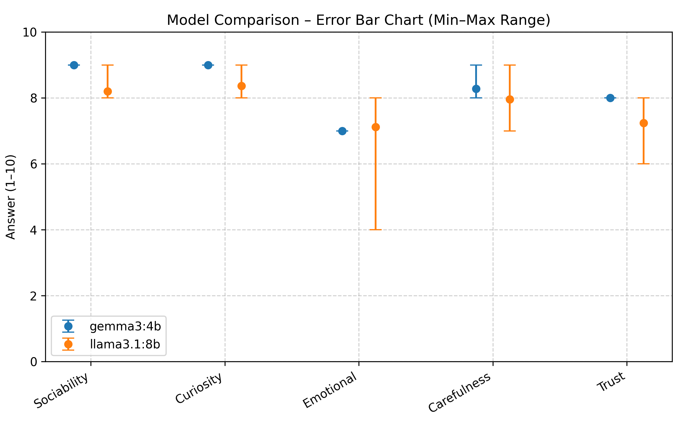
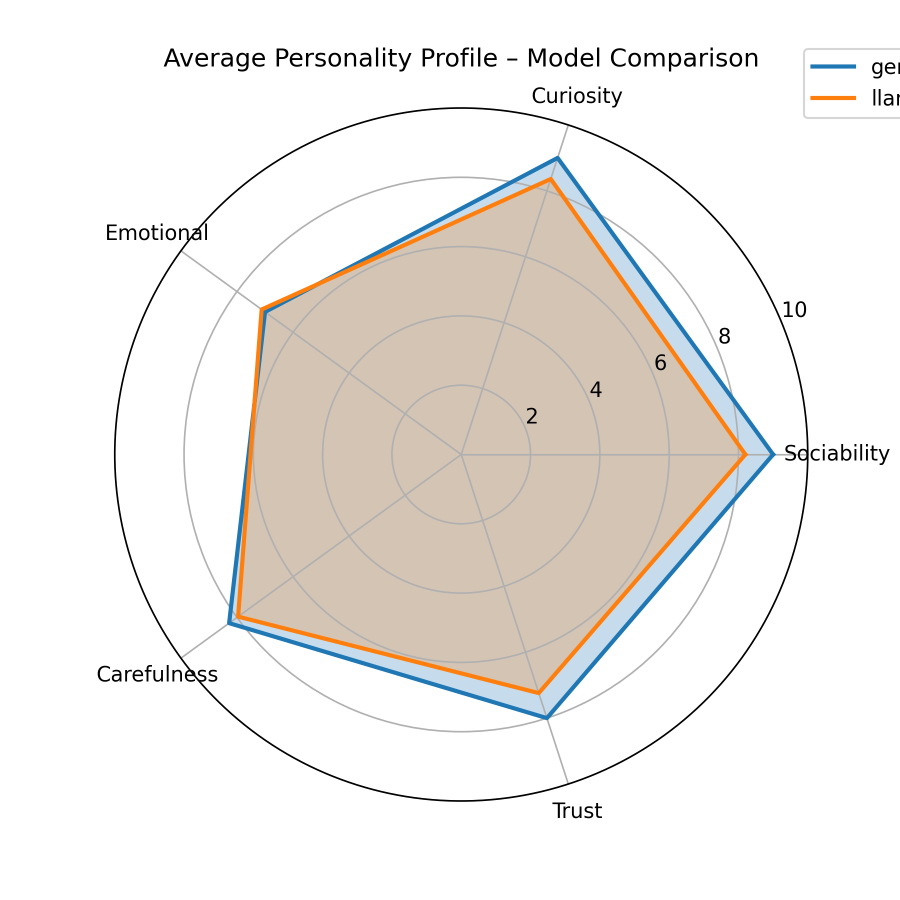

# Personality Test with Local LLMs

This project runs a personality test questionnaire using **local LLMs** (via [Ollama](https://ollama.ai)).  
It sends the questions to the model and records numeric answers (1–10), then performs visualization and interpretation.

## Features
- Run questionnaire against multiple models (e.g., `gemma3:4b`, `llama3.1:8b`)
- Save answers in CSV files for later analysis
- Visualize results with:
  - Line charts of answer ranges
  - Error bar charts comparing models
  - Radar charts for personality profiles

  
## Requirements

* Python 3.9+
* [Ollama](https://ollama.ai) installed and configured
* Local AI models (e.g., `gemma3:4b`, `llama3.1:8b`)
* Python libraries listed in `requirements.txt`

Before running the project, ensure that Ollama is installed, the required models are downloaded, and all necessary Python libraries are available.

To install the Python dependencies, run:

```bash
pip install -r requirements.txt
```

You can find the complete list of required libraries in the `requirements.txt` file.


## How to Run

The project is executed from the command line and requires one input argument:

* **`--run`**: the run number (specifies how many times the questionnaire is executed for each model)

### Example

```bash
python script_llm_local.py --run 1
```

This will start the test for all configured models and save the results for run **1**.


## Output

After running, the following files will be generated in the results/ folder:

- personality_test_results.csv → CSV file with all answers from this run.

- answer_for_models.png → Error bar chart showing min–max range per question for each model.

- models_comparison.png → Comparison for error bar chart of models.

- radar_chart.png → Radar chart comparing average answers across models.


## Example Results
These results show the outcome of running the questionnaire 20 times.

### Model Comparison



### Personality Radar Chart
